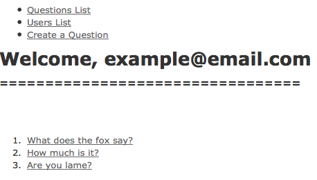

Question & Answer
==================

A Ruby on Rails Sample App
--------------------------

By Robin Swenson-Healey

Description
-----------

This app showcases *has_many_and_belongs_to* for two controllers.  In this example, *Users* are intimately tied to *Questions*.  When a User logs in and creates a question, there is storage into a *join table*.

Created Oct, 2013

